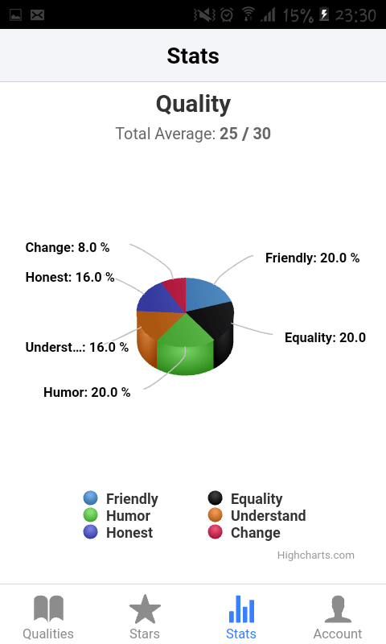
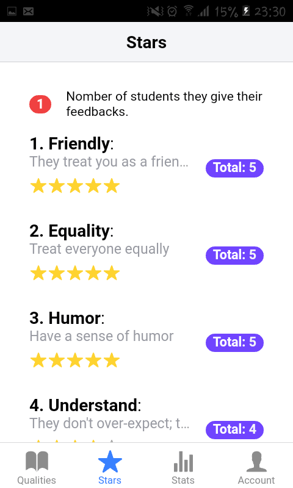
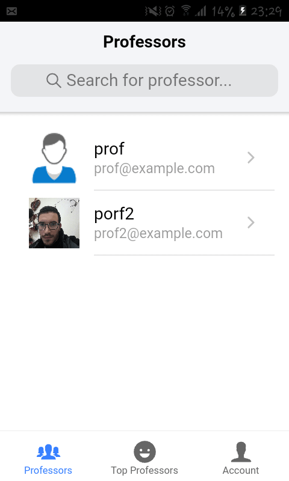
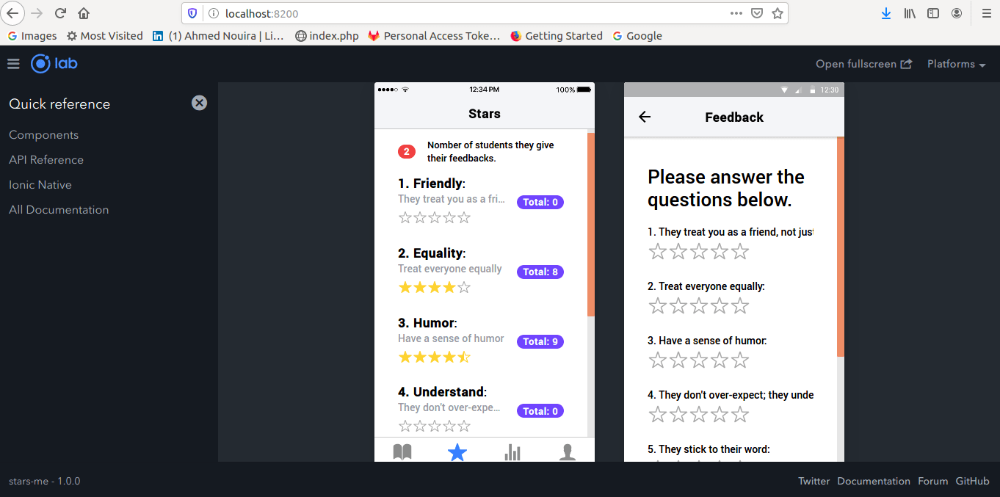

# StarsME

**Ionic 4 App that allows you to give feedback to professors**.

:star2: StarsME is firebase-based :fire: mobile application :iphone: that allows students :mortar_board:  give their feedback to professors based on :six: qualities (Friendly, Equality, Humor, Understand, Honest, Change) :star2:.

---

## Screenshots 



## What is Firebase ?

> Firebase is a Backend as a service **Baas** by <mark>Google</mark>, Firebase provides a real-time backend for various kinds of applications it provides: 
-[x] data store
-[x] authentication
-[x] static hosting

## Defining our app 

In this section, we will define our application structure and architecture.

### 1. Functionalites & Features 

Our app includes the following features: 

* E-mail password authentication + Social Media autentication (**Google**, **Facebook**).
 * **Student Feature**:
  1. A list of all Professors of the application + search for a specfic Professor.
   * Send Email.
   - Give feedback. 
  2. List of top professors.
  3. Account: 
   - Change profile picture
   - Edit personal info.
   - Logout.
 * **Professor Feature**:
  1. List of 6 Qualites
   - Read more. 
  2. Stars stats.
  3. 3D charts.
  4. Account: 
   - Change profile picture
   - Edit personal info
   - Logout

### App workflow

How the app works and goes form one page to another page ?


### Firebase Firestore Data Structure

> **Cloud Firestore** is a cloud-hosted, NoSQL database, Cloud Firestore's NoSQL data model allows you store data in documents that contain fields mapping to values. These documents are stored in collections, which are containers for your documents that you can use to organize your data and build queries. 


####  professors Collection

``` json
"professors": [{
    "professorID": {
            "name": "Ahmed Nouira",
            "email": "ahmnouira@gmail.com",
            "picture": "user's base64 encode picture",
            "tel" : "24272897",
            "address": "",
            "abouMe" :"",
            "created_at": 1577991867.945,
            "totalStars" : 23,
            "notes": [{
                "studentID" : {
                    "Change": 4,
                    "Equality": 3,
                    "Friendly": 1,
                    "Honest": 2,
                    "Humour": 0,
                    "Undestand": 5,
                    "created_at": 1579042961325,
                    "updated_at": 1579042961325
                }
            }] 
        }
    },

    ]
```
### students Collection
``` json 
"students": [{
    "studentID" : {
        "name": "et1",
        "email": "et1@example.com",
        "tel": "",
        "address":"",
        "aboutMe" :"",
        "created_at": 1579030198.077
    }
}, 

] 

```

## Setting up

Before we can acually start working on the our app, we need the following software tools and libraires to get started.

### Run as Angular App 

1. clone the repository `git clone https://github.com/ahmnouira/StarsME`.
2. `cd StarsME/` to enter to the app root folder.
3. `npm install` to install the dependencies`.
4. start the server `npm start`

### Run in Ionic Lab 

* `ionic serve --lab` 




### Android Setup 

To target the Android platform, some setups is required.

1. install **Java**: native Android apps complied with Java.
2. install **Gradle**: the build tool used in Android Apps and must be installed speratly.
3. install **Android Studio**: the IDE for creation native Android apps it includes Android SDK, which will need to be configured for us in the command line.

### Run as an Android App 

1. run `cordova-res android` to generate _icons_ and _splashs_ images for android.
2. run `cordova platform add android` add android *platform*, *plugins* used for this app.
3. `ionic cordova build android` to build app and get **.apk** file.

**Note**: the .apk file is located in`StarsME/platforms/android/app/build/outputs/apk/debug/app-debug.apk`

### Publishing as Progressive Web Application (PWA) 

* Because ionic apps built with web technologies, they can run just as well as progressive web app as they can a native app.

1. `ng add @angular/pwa` add **@angular/service-worker** pacakge and enable service-workers.
2. `ionic build --prod` to build optimazed version of the app.

#####  Test the your build project

* `ng serve` does not work with _service workers_ you must use a seperate HTTP server to test your project **locally**.

run `npx http-server -p 8080 -c-1 www/` to see the service.

### Firebase Hosting Deploying 

1. run ` cd functions/ && npm i && cd ..` to install dependencies for *functions/* folder.
2. `ionic build --prod` to build optimazed version of the app.
3. `firebase deploy` to deploy the app.

This app will be alive at : https://takecare-3fa5e.firebaseapp.com

